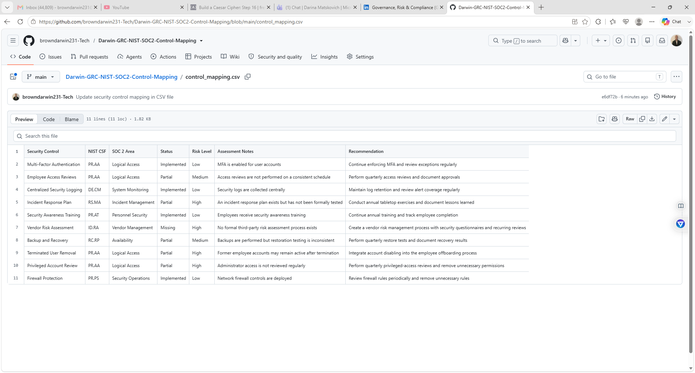
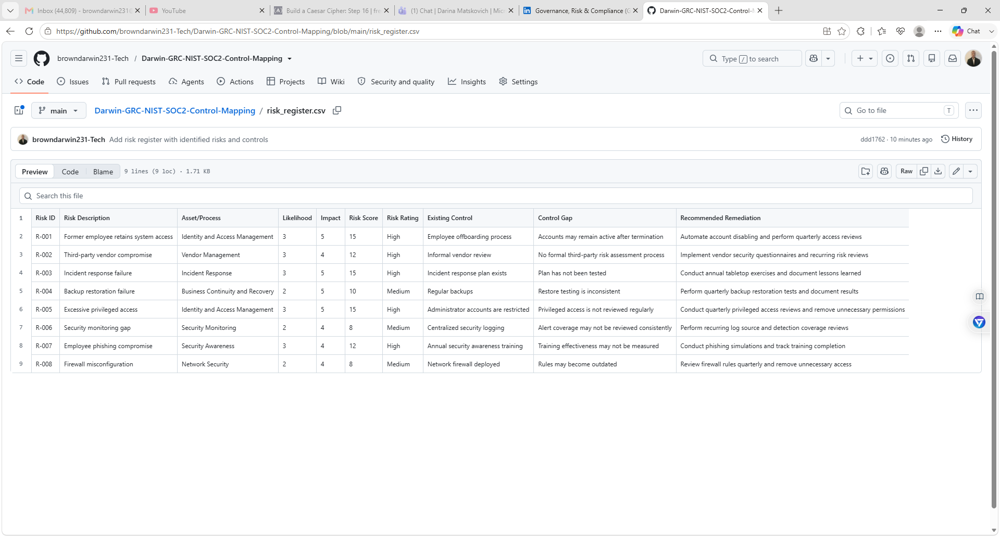
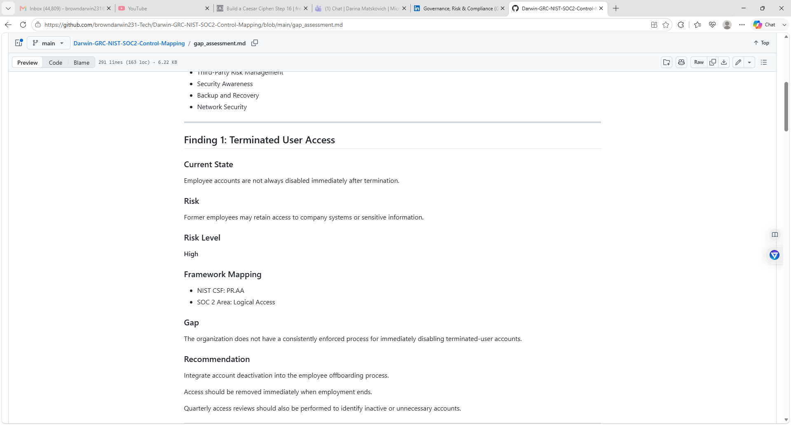

# Darwin-GRC-NIST-SOC2-Control-Mapping

Hands-on GRC project mapping security controls to NIST CSF and SOC 2, identifying compliance gaps, assessing risk, and documenting remediation recommendations.

- Security control assessment
- Risk identification
- Risk prioritization
- NIST CSF control mapping
- SOC 2 control mapping
- Gap analysis
- Risk register development
- Remediation planning
- Compliance documentation

## Business Scenario

CloudNova Technologies is a fictional SaaS company with approximately 75 employees.

The organization currently uses:

- Microsoft 365
- Microsoft Azure
- Multi-Factor Authentication
- Endpoint Protection
- Network Firewalls
- Centralized Logging
- Security Awareness Training
- Data Backups

## Identified Control Gaps

- Administrator accounts are not reviewed regularly
- Former employee accounts may remain active after termination
- No formal third-party vendor risk assessment process exists
- Incident response exercises have not been performed
- Backup restoration testing is inconsistent

## Frameworks Used

### NIST Cybersecurity Framework

The NIST Cybersecurity Framework helps organizations identify, manage, and reduce cybersecurity risk.

Major NIST CSF functions include:

- Govern
- Identify
- Protect
- Detect
- Respond
- Recover

### SOC 2

SOC 2 focuses on organizational controls related to:

- Security
- Availability
- Confidentiality
- Processing Integrity
- Privacy

## Control Mapping

| Security Control | NIST CSF | SOC 2 Area | Status | Risk |
|---|---|---|---|---|
| Multi-Factor Authentication | PR.AA | Logical Access | Implemented | Low |
| Employee Access Reviews | PR.AA | Logical Access | Partial | Medium |
| Centralized Security Logging | DE.CM | System Monitoring | Implemented | Low |
| Incident Response Plan | RS.MA | Incident Management | Partial | High |
| Security Awareness Training | PR.AT | Personnel Security | Implemented | Low |
| Vendor Risk Assessment | ID.RA | Vendor Management | Missing | High |
| Backup & Recovery | RC.RP | Availability | Partial | Medium |
| Terminated User Removal | PR.AA | Logical Access | Partial | High |

## Risk Assessment

| Risk | Likelihood | Impact | Risk Score | Rating |
|---|---:|---:|---:|---|
| Former employee retains system access | 3 | 5 | 15 | High |
| Third-party vendor compromise | 3 | 4 | 12 | High |
| Incident response failure | 3 | 5 | 15 | High |
| Backup restoration failure | 2 | 5 | 10 | Medium |

## Key Findings

### Access Management

Former employee accounts may remain enabled after termination, increasing the possibility of unauthorized access.

**Recommendation:** Integrate account disabling into the employee offboarding process and perform recurring access reviews.

### Vendor Risk Management

CloudNova Technologies does not currently maintain a formal third-party risk management process.

**Recommendation:** Implement vendor security questionnaires, risk classifications, security reviews, and recurring third-party assessments.

### Incident Response

The organization maintains an incident response plan but has not tested the plan through formal exercises.

**Recommendation:** Conduct annual tabletop exercises and document findings, lessons learned, and corrective actions.

### Backup Validation

Backups are being performed, but restoration testing is inconsistent.

**Recommendation:** Perform quarterly backup restoration testing and maintain documentation showing successful recovery tests.

## Remediation Priorities

1. Improve terminated-user account removal procedures
2. Conduct an incident response tabletop exercise
3. Establish a third-party risk management program
4. Implement recurring privileged-access reviews
5. Establish quarterly backup restoration testing

## Risk Scoring Method

Risk Score = Likelihood × Impact

- 1–4 = Low
- 5–10 = Medium
- 11–15 = High
- 16–25 = Critical

## Repository Structure

Darwin-GRC-NIST-SOC2-Control-Mapping/
│
├── README.md
├── control_mapping.csv
├── risk_register.csv
├── gap_assessment.md
├── remediation_plan.md
└── evidence/

# Evidence Screenshots

### Control Mapping

### Risk Register

### Gap Assessment

## Skills Demonstrated

- Governance, Risk, and Compliance
- NIST CSF
- SOC 2
- Risk Assessment
- Risk Registers
- Control Mapping
- Gap Analysis
- Security Governance
- Access Management
- Incident Response
- Third-Party Risk Management
- Remediation Planning
- Compliance Documentation

## Project Goal

The goal of this project is to demonstrate practical GRC analysis by evaluating organizational security controls, identifying weaknesses, mapping controls to recognized cybersecurity frameworks, prioritizing risk, and developing actionable remediation recommendations.
